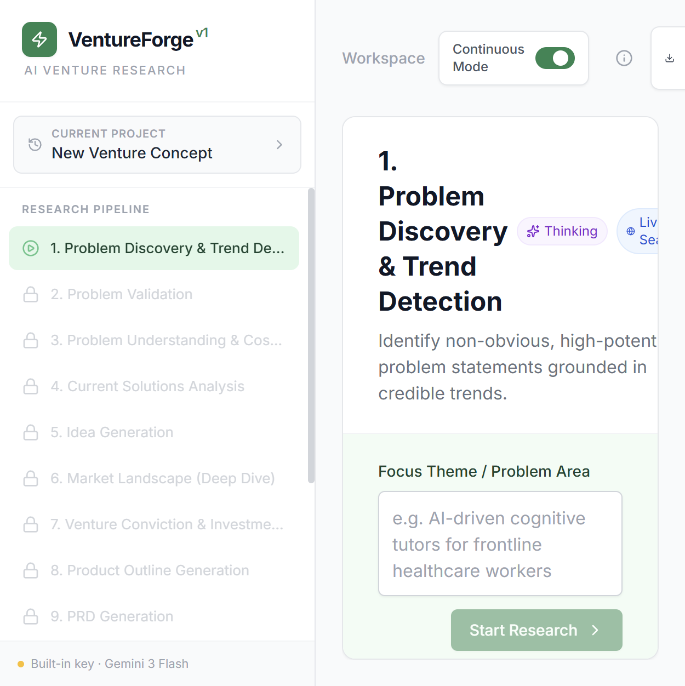
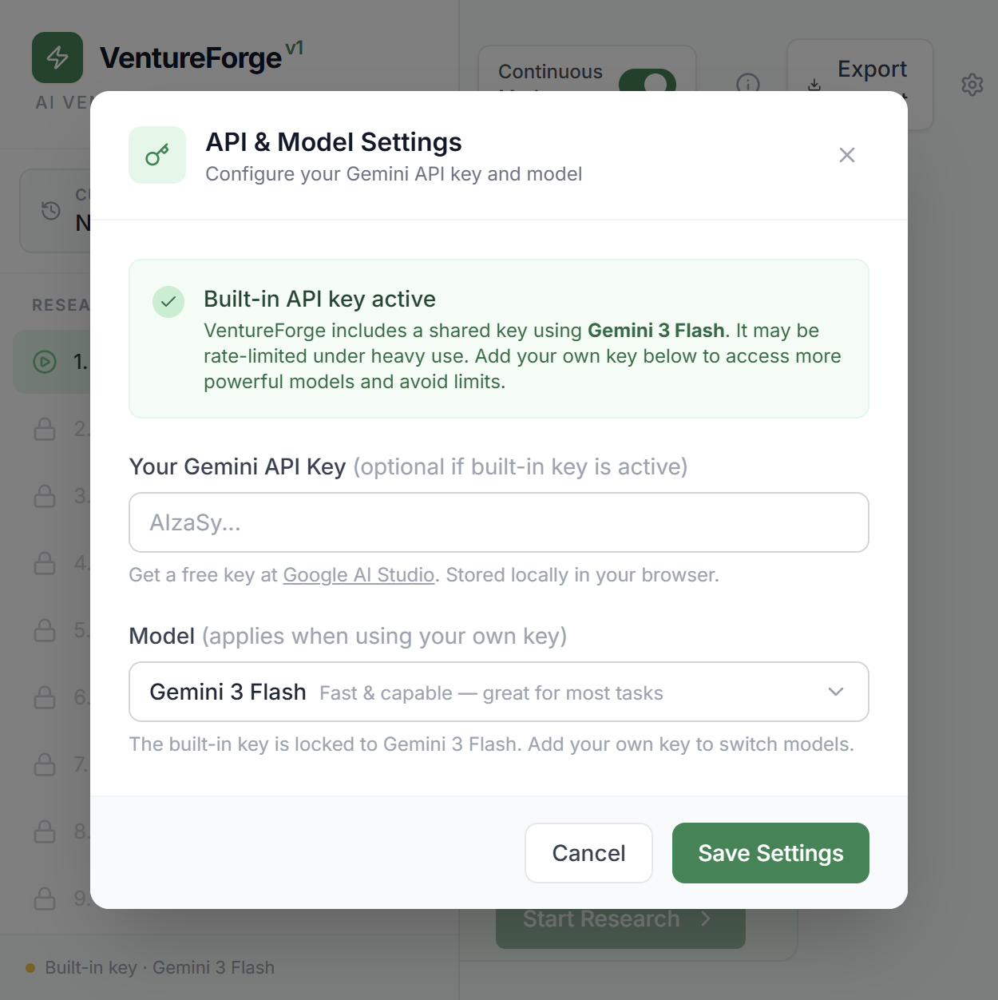

# VentureForge

**An AI-powered, end-to-end venture research engine.** VentureForge runs a 14-step autonomous research pipeline — from trend detection and problem validation through to market analysis, product specs, financial modeling, and a pitch deck outline — powered by Google Gemini 3.



---

## What It Does

You give VentureForge a focus area or problem theme. It then autonomously:

1. **Problem Discovery & Trend Detection** — Surfaces non-obvious, high-signal problem statements from live web research
2. **Problem Validation** — Finds qualitative evidence of real pain (Reddit, HN, papers, forums)
3. **Problem Understanding & Cost Analysis** — Root cause analysis and cost-of-inaction quantification
4. **Current Solutions Analysis** — Competitive landscape mapping and gap identification
5. **Idea Generation** — Structured venture concepts with unfair advantage framing
6. **Market Landscape (Deep Dive)** — VC-grade due diligence: 10-15 players, graveyard analysis, white space
7. **Venture Conviction & Investment Thesis** — High-conviction synthesis: why now, why win, bear case
8. **Product Outline Generation** — Ruthless MVP scoping with core value loop definition
9. **PRD Generation** — Full product requirements document with user stories and success metrics
10. **Roadmap Generation** — Phased execution roadmap (MVP → V1 → V2)
11. **Business & Revenue Model** — Monetization options with pricing benchmarks
12. **Financial Analysis** — TAM/SAM/SOM sizing and 36-month projections
13. **Risk Assessment** — Top success factors and existential risks with mitigations
14. **Output Generation** — Executive summary and pitch deck outline

Each module builds on the last. Enable **Continuous Mode** to run the full pipeline automatically, or step through manually.

---

## Key Features

- **Continuous Mode** — Toggle on to run the entire pipeline hands-free from a single input
- **Live Web Grounding** — Key modules use Google Search to validate findings in real time
- **Deep Dive Chat** — Ask follow-up questions about any module's output, upload files for context
- **Version History** — Every re-run saves a previous version; compare across runs
- **PDF Export** — Professional, formatted report with all analysis, citations, and chat logs
- **Multi-Project Support** — Run multiple venture analyses simultaneously
- **Built-in API Key** — Works out of the box; add your own key for more powerful models

---

## API & Model Setup

VentureForge includes a **built-in Gemini API key** (shared, free tier) that uses **Gemini 3 Flash**. This works without any configuration, but may be rate-limited under heavy use.

For best results, add your own API key via the settings (⚙️ icon):

| Key Type | Model Options | Notes |
|---|---|---|
| Built-in (shared) | Gemini 3 Flash | Free, may rate-limit |
| Your own key | Gemini 3 Flash | Fast & capable |
| Your own key | Gemini 3.1 Pro | Most powerful |
| Your own key | Gemini 3.1 Flash Lite | Fastest, most economical |

Get a free API key at [Google AI Studio](https://aistudio.google.com/app/apikey). Your key is stored only in your browser's local storage.



---

## Running Locally

**Prerequisites:** Node.js 18+

```bash
# Clone the repo
git clone https://github.com/your-username/ventureforge.git
cd ventureforge

# Install dependencies
npm install

# (Optional) Set your Gemini API key as the built-in key
# Create .env.local and add:
# GEMINI_API_KEY=your_key_here

# Start development server
npm run dev
```

Open [http://localhost:3000](http://localhost:3000).

If you don't set `GEMINI_API_KEY` in `.env.local`, you'll be prompted to enter an API key in the app, or you can add one via the ⚙️ settings icon.

---

## Building for Production

```bash
npm run build   # Outputs to dist/
npm start       # Serves the built app (uses `serve`)
```

---

## Deploying to Railway

### Option 1: Deploy via Railway CLI

```bash
# Install Railway CLI
npm install -g @railway/cli

# Login and deploy
railway login
railway init
railway up
```

Set the `GEMINI_API_KEY` environment variable in your Railway project settings. This key gets baked into the build and used as the built-in shared key.

### Option 2: Deploy via Railway Dashboard

1. Connect your GitHub repo at [railway.app](https://railway.app)
2. Create a new project and select your repo
3. Add the environment variable: `GEMINI_API_KEY = <your_key>`
4. Railway auto-detects the `railway.toml` config and deploys

The `railway.toml` in this repo handles the build (`npm run build`) and start (`npm start`) commands automatically.

> **Note on key security:** The `GEMINI_API_KEY` is injected at build time by Vite and baked into the static JS bundle. This is the standard approach for client-side apps without a backend. For a production deployment with sensitive keys, consider adding a lightweight API proxy. For the included shared key (which is a free-tier burner key), this is acceptable.

---

## Tech Stack

- **Framework:** React 19 + TypeScript
- **Bundler:** Vite 6
- **AI:** Google Gemini API (`@google/genai`)
  - Gemini 3 Flash (default), Gemini 3.1 Pro, Gemini 3.1 Flash Lite
  - Thinking mode (deep reasoning) on key modules
  - Google Search grounding on research-heavy modules
- **Styling:** Tailwind CSS (CDN config)
- **Markdown:** `react-markdown` + `remark-gfm`
- **Icons:** Lucide React
- **State:** React state + localStorage persistence
- **Deployment:** Railway (static, served via `serve`)

---

## Project Structure

```
ventureforge/
├── App.tsx                    # Root app, state management, pipeline logic
├── constants.ts               # Module definitions, prompts, model configs
├── types.ts                   # TypeScript types
├── index.tsx                  # React entry point
├── index.html                 # HTML shell with Tailwind config
├── vite.config.ts             # Vite build config (env injection)
├── railway.toml               # Railway deployment config
├── services/
│   └── geminiService.ts       # Gemini API calls (generate + chat)
└── components/
    ├── Sidebar.tsx            # Navigation, project switcher, pipeline list
    ├── ModuleView.tsx         # Per-module output, chat, version history
    └── WelcomeModal.tsx       # Onboarding modal
```

---

## Usage Tips

- **Continuous Mode** runs the full 14-step pipeline automatically after you submit a theme. Best for comprehensive research sessions.
- **Manual Mode** (toggle off Continuous Mode) lets you step through each module, review the output, and chat before proceeding.
- **Deep Dive Chat** is available after each module completes. Use it to drill into specific findings, challenge assumptions, or explore alternative angles.
- **Re-run** any module to regenerate with fresh research; previous results are saved as version history.
- **Export Report** generates a print-ready PDF of all completed modules, including citations and chat logs.

---

## License

MIT
